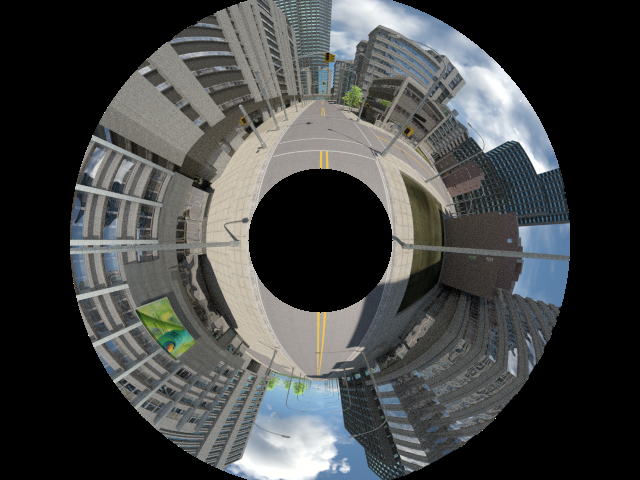
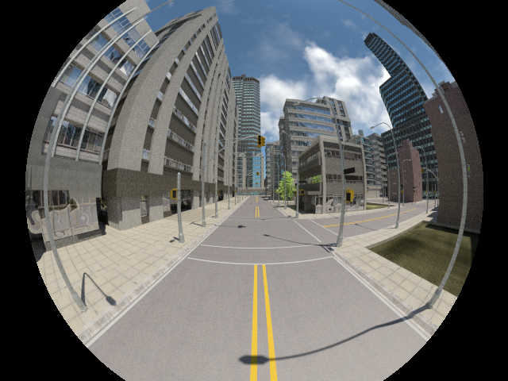
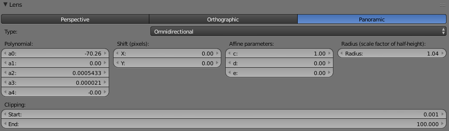

This patch add a new omnidirectional camera model in Blender, allowing it to render images according to the [omnidirectional camera model](https://sites.google.com/site/scarabotix/ocamcalib-toolbox)

<table>
<tr>
 <td></td>
 <td></td>
</tr>
</table>

# Building

Follow the instructions on the [Blender Wiki](http://wiki.blender.org/index.php/Dev:Doc/Building_Blender/Linux/Ubuntu/CMake) to compile Blender.

Before compiling, apply the patch ("0001-Add-omnidirectional-camera-model-to-Cycles-rendering.patch") to the source code.
If you have any conflicts, checkout the commit "c1506454ecb4630119ed7ce13b3f8cdfef6dcee0") and apply the patch again.

Tip: if you don't need OpenCollada nor OSL, you can skip them in the external deps building step:

        install_deps.sh --skip-osl --skip-opencollada

# Using the Omnidirectional camera model

* Make sure you're using the [Cycles render engine](http://www.blender.org/manual/render/cycles/introduction.html)
* Select your camera, and go to the camera panel
* Switch the Lens type to "Panoramic" and select the "Omnidirectional" lens subtype
* Render your image normally (both CPU and GPU rendering are supported)

## Omnidirectional camera parameters

* *Polynomial*: a0, a1, a2, a3, a4, a5 correspond to the polynomial backward projection function parameters (in increasing degree order)
* *Shift*: projection center shift from the image center, in pixels
* *Affine*: correspond to the affine parameters in the omnidirectional camera model
* *Radius*: scale factor used to compute the radius of the crop circle (radius = scale * image_height / 2.0). If zero, no crop circle is added.

### How to get these parameters?

The easiest is to get them from a real fisheye or catadioptric camera. Calibrate your camera using [the Ocamcalib toolbox](https://sites.google.com/site/scarabotix/ocamcalib-toolbox).
The toolbox will output the necessary parameters.

Warning: one set of parameters is valid for a given image size.

## Known issues

* Using motion blur using the omnidirectional camera leads to incorrect results
